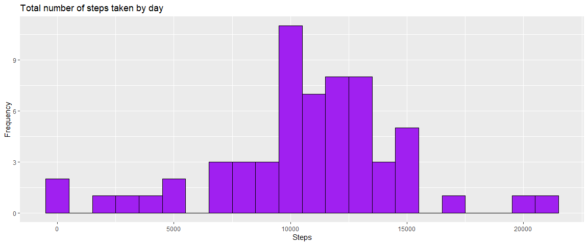

## Loading and Preprocessing the data


```r
activity <- read.csv("activity.csv")
activity$day <- weekdays(as.Date(activity$date))
activity$DateTime <- as.POSIXct(activity$date, format = "%Y-%m-%d")
activityclean <- activity[!is.na(activity$steps), ]
```

## What is the mean total number of steps taken per day?

1. Calculate the total number of steps taken per day


```r
sum_Steps <- aggregate(activity$steps ~ activity$date, FUN = sum, na.rm = TRUE)
colnames(sum_Steps) <- c("Date", "Steps")
```

2. Make a histogram of the total number of steps taken each day


```r
library(ggplot2)
ggplot(sum_Steps, aes(x = Steps)) + geom_histogram(fill = "midnight blue", col = "black", binwidth = 1000) + labs(title = "Total number of steps taken by day", x = "Steps", y = "Frequency")
```

<!-- -->

3. Calculate and report the mean and median of the total number of steps taken per day


```r
as.integer(mean(sum_Steps$Steps))
```

```
## [1] 10766
```


```r
as.integer(median(sum_Steps$Steps))
```

```
## [1] 10765
```

The average number of steps taken each day was 10766 steps.
The median number of steps taken each day was 1075 steps.

## What is the average daily activity pattern?

1. Make a time series plot (i.e. \color{red}{\verb|type = "l"|}type = "l") of the 5-minute interval (x-axis) and the average number of steps taken, averaged across all days (y-axis)


```r
library(plyr)
activityclean <- activity[!is.na(activity$steps), ]
average_by_interval <- ddply(activityclean, .(interval), summarize, Avg = mean(steps))

library(ggplot2)
ggplot(average_by_interval, aes(x = interval, y = Avg)) + geom_line(color = "dark green", size = 1) + labs(title = "Average number of steps per interval", x = "Interval", y = "Average number of steps") 
```

<!-- -->

2.Which 5-minute interval, on average across all the days in the dataset, contains the maximum number of steps?


```r
maximum_interval <- max(average_by_interval$Avg)
average_by_interval[average_by_interval$Avg == maximum_interval, 1]
```

```
## [1] 835
```

The maximum number of steps for a 5-minute interval was 206 steps.
The 5-minute interval which had a maximum number of steps was the 835 interval. 

## Imputing missing values

1. Calculate and report the total number of missing values in the dataset (i.e. the total number of rows with \color{red}{\verb|NA|}NAs)


```r
nrow(activity[is.na(activity$steps),])
```

```
## [1] 2304
```

The total number of rows with steps = "NA" is 2304.

2. Devise a strategy for filling in all of the missing values in the dataset. The strategy does not need to be sophisticated. For example, you could use the mean/median for that day, or the mean for that 5-minute interval, etc.

3. Create a new dataset that is equal to the original dataset but with the missing data filled in.


```r
mean_by_interval <- ddply(activityclean, .(interval, day), summarize, Avg = mean(steps))
na_data <- activity[is.na(activity$steps), ]
replace <- merge(na_data, mean_by_interval, by = c("interval", "day"))

replace2 <- replace[, c(6, 4, 1, 2, 5)]
colnames(replace2) <- c("steps", "date", "interval", "day", "DateTime")

activityFill <- rbind(activityclean, replace2)
```

4. Make a histogram of the total number of steps taken each day and Calculate and report the mean and median total number of steps taken per day. Do these values differ from the estimates from the first part of the assignment? What is the impact of imputing missing data on the estimates of the total daily number of steps?


```r
sum_Steps2 <- aggregate(activityFill$steps ~ activityFill$date, FUN = sum, na.rm = TRUE)
colnames(sum_Steps2) <- c("Date", "Steps")

library(ggplot2)
ggplot(sum_Steps2, aes(x = Steps)) + geom_histogram(fill = "purple", col = "black", binwidth = 1000) + labs(title = "Total number of steps taken by day", x = "Steps", y = "Frequency")
```

<!-- -->


```r
as.integer(mean(sum_Steps2$Steps))
```

```
## [1] 10821
```


```r
as.integer(median(sum_Steps2$Steps))
```

```
## [1] 11015
```

The new mean of the imputed data is 10821 steps compared to the old mean of 10766 steps. That creates a difference of 55 steps on average per day.
The new median of the imputed data is 11015 steps compared to the old median of 10765 steps. That creates a difference of 250 steps for the median.  

## Are there differences in activity patterns between weekdays and weekends?

1. Create a new factor variable in the dataset with two levels – “weekday” and “weekend” indicating whether a given date is a weekday or weekend day.


```r
activityFill$DayType <- ifelse(activityFill$day %in% c('Saturday', 'Sunday'), "weekend", "weekday")
average_by_interval2 <- aggregate(activityFill$steps, by = list(activityFill$DayType, activityFill$interval), FUN = mean, na.rm = TRUE)
colnames(average_by_interval2) <- c("DayType", "interval", "steps")
```

2. Make a panel plot containing a time series plot (i.e. \color{red}{\verb|type = "l"|}type = "l") of the 5-minute interval (x-axis) and the average number of steps taken, averaged across all weekday days or weekend days (y-axis). See the README file in the GitHub repository to see an example of what this plot should look like using simulated data.


```r
library(lattice)
xyplot(steps ~ interval | DayType, average_by_interval2, type = "l", lwd = 2, main = "Average number of steps per interval", ylab = "Average number of steps", xlab = "Interval", layout = c(1, 2))
```

<!-- -->
